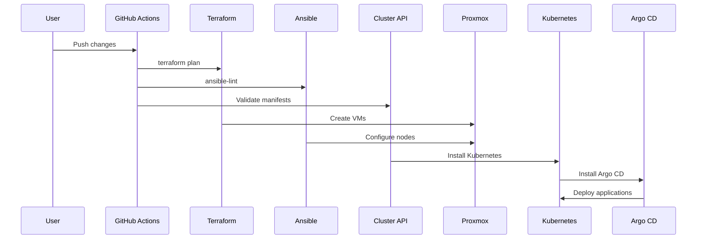

# KubeOps Architecture Design

> **Status:** initial design document, kept for historical reference. The
> up-to-date documentation lives in [docs/](../docs/) — see
> [Architecture](../docs/architecture.md) and
> [CI/CD Pipeline](../docs/cicd.md).

## 1. Project Overview

**Project Name:** KubeOps  
**Purpose:** Deploy a production-ready Kubernetes cluster on Proxmox using Infrastructure as Code and GitOps principles.  
**Primary Language:** Go (v1.21+)  
**Target Environment:** Proxmox Virtual Environment (VE)

## 2. Technology Stack

| Category | Technology | Version |
|----------|------------|---------|
| Infrastructure as Code | Terraform | v1.6+ |
| Configuration Management | Ansible | v2.14+ |
| Kubernetes Cluster Provisioning | Cluster API (CAPI) | v1.5+ |
| Container Network Interface | Cilium | v1.14+ |
| GitOps | Argo CD | v2.8+ |
| Package Management | Helm | v3.12+ |
| Secrets Management | Vault | v1.14+ |
| API Gateway | Gateway API | v1.0+ |
| CI/CD | GitHub Actions | - |
| Monitoring | Prometheus + Grafana | Latest |
| Programming Language | Go | v1.21+ |

## 3. CI/CD Pipeline Stages

```mermaid
flowchart LR
    A[1. Validation] --> B[2. Build]
    B --> C[3. Unit Tests]
    C --> D[4. Integration Tests]
    D --> E[5. E2E Tests]
    E --> F[6. Security Scan]
    F --> G[7. Packaging]
    G --> H[8. Deploy to Test]
    H --> I[9. Validate]
    I --> J[10. Deploy to Prod]
    J --> K[11. Monitor]
    K --> L[12. Feedback]
```



### Stage Details

1. **Validation**: Validate YAML, Terraform syntax, Go code formatting
2. **Build**: Build Go binary, compile Terraform modules
3. **Unit Tests**: Run Go unit tests, Ansible molecule tests
4. **Integration Tests**: Test Terraform-Ansible integration
5. **E2E Tests**: Deploy test cluster, verify Kubernetes components
6. **Security Scan**: Scan for vulnerabilities (Trivy, Checkov)
7. **Packaging**: Create release artifacts, Helm charts
8. **Deploy to Test**: Deploy to staging environment
9. **Validate**: Run smoke tests, health checks
10. **Deploy to Prod**: Deploy to production environment
11. **Monitor**: Verify metrics, alerts, logs
12. **Feedback**: Collect metrics, generate reports

## 4. Component Details

### 4.1 Terraform Modules

| Module | Purpose |
|--------|---------|
| `compute` | Proxmox VM creation (control plane, workers) |
| `network` | VLAN, bridge, firewall configuration |
| `storage` | Ceph/RBD or local storage provisioner |

### 4.2 Ansible Roles

| Role | Purpose |
|------|---------|
| `common` | OS tuning, kernel modules, sysctl |
| `containerd` | Container runtime installation |
| `kubeadm` | Kubernetes components installation |
| `kubeconfig` | Distribute kubeconfig from control plane |

### 4.3 Cluster API Resources

- **Cluster**: Defines cluster scope
- **KubeadmControlPlane**: Control plane management
- **MachineDeployment**: Worker node groups
- **ProxmoxMachineTemplate**: Node specifications

### 4.4 Go CLI Commands (kubeops)

```go
// Planned commands
kubeops init          // Initialize new cluster
kubeops deploy        // Deploy cluster
kubeops destroy       // Teardown cluster
kubeops status        // Show cluster status
kubeops secrets       // Manage secrets via Vault
kubeops app           // Manage applications
kubeops validate      // Run validation checks
kubeops version       // Show version
```

## 5. Deployment Workflow



## 6. Security Considerations

- **Secrets**: All secrets stored in Vault, injected via CSI Provider
- **Network**: Cilium Network Policies for pod-to-pod isolation
- **RBAC**: Fine-grained RBAC for Kubernetes resources
- **Certificates**: cert-manager for TLS certificate management
- **Scan**: Trivy for container image scanning, Checkov for IaC

## 7. Monitoring Stack

- **Prometheus**: Metrics collection
- **Grafana**: Visualization and dashboards
- **Alertmanager**: Alert routing
- **Loki**: Log aggregation (optional)
- **Exporters**: node-exporter, kube-state-metrics, cilium-metrics

## 8. Implementation Priority

1. Project scaffolding (Go module, Makefile)
2. Terraform modules for Proxmox
3. Ansible playbooks for node preparation
4. Cluster API manifests
5. Cilium configuration
6. Vault integration
7. Argo CD setup
8. Helm charts
9. Gateway API
10. GitHub Actions workflows
11. Monitoring stack
12. Go CLI implementation
13. Tests

## 9. Estimated Milestones

- **M1**: Infrastructure provisioning (Terraform + Ansible)
- **M2**: Kubernetes cluster deployment (CAPI)
- **M3**: Networking and security (Cilium + Vault)
- **M4**: GitOps pipeline (Argo CD + Helm)
- **M5**: API Gateway and monitoring
- **M6**: CI/CD automation (GitHub Actions)
- **M7**: CLI tool and documentation
